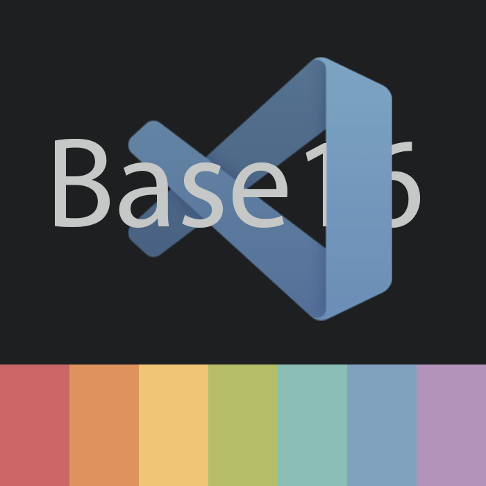
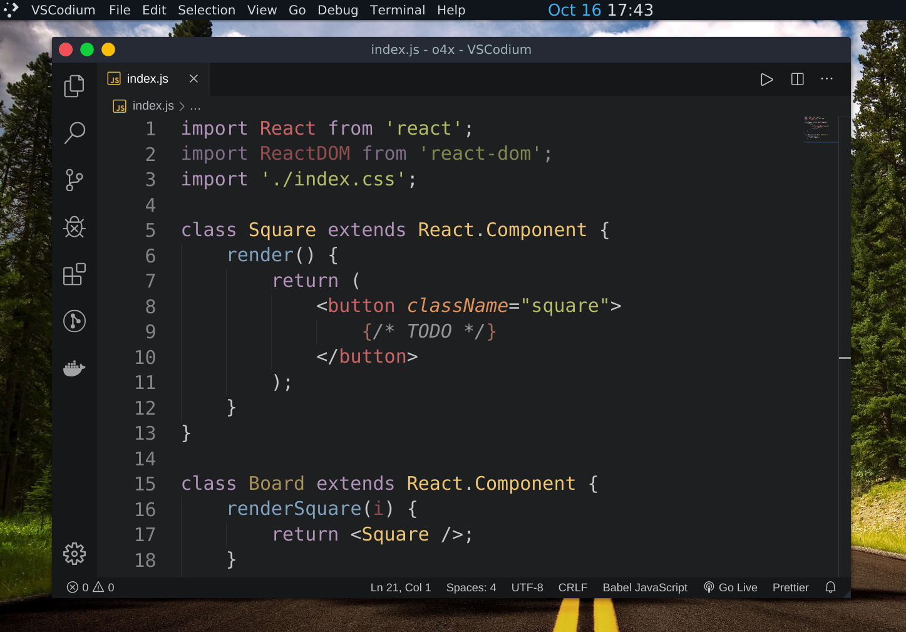
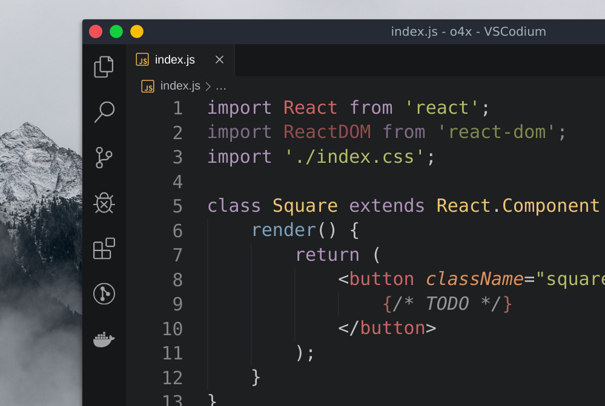
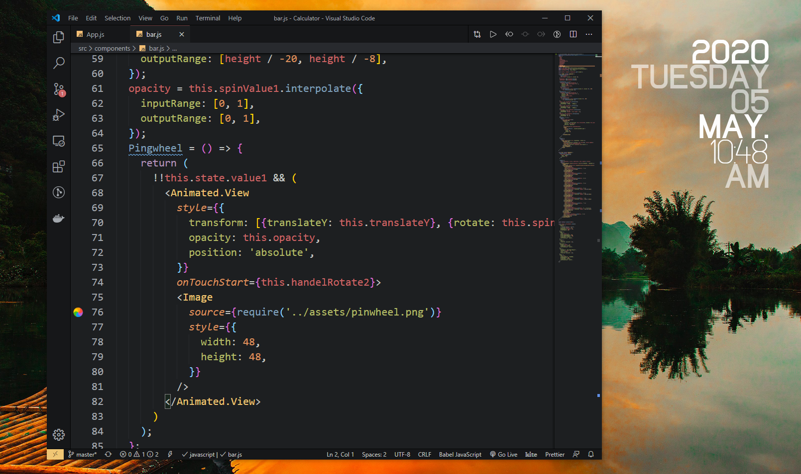

# Base16 Tomorrow 🏳‍🌈

A Visual Studio Code theme like atom's Base16 Tomorrow. Color choices have taken into consideration what is accessible to people with colorblindness and in low-light circumstances. Decisions were also based on meaningful contrast for reading comprehension and for optimal razzle dazzle. ✨

## Linux

## Windows

# Installation

1.  Install [Visual Studio Code](https://code.visualstudio.com/)
2.  Launch Visual Studio Code
3.  Choose **Extensions** from menu
4.  Search for `Base16 Tomorrow`
5.  Click **Install** to install it
6.  Click **Reload** to reload the Code
7.  From the menu bar click: Code > Preferences > Color Theme > **Base16 Tomorrow**
8. Enjoy 😉